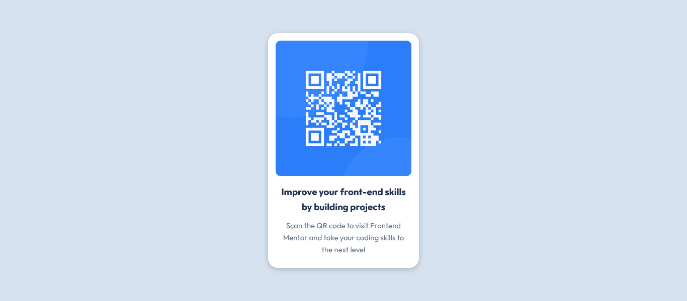

# Frontend Mentor - QR code component solution

This is a solution to the [QR code component challenge on Frontend Mentor](https://www.frontendmentor.io/challenges/qr-code-component-iux_sIO_H). Frontend Mentor challenges help you improve your coding skills by building realistic projects. 

## Table of contents

- [Overview](#overview)
  - [Screenshot](#screenshot)
  - [Links](#links)
- [My process](#my-process)
  - [Built with](#built-with)
  - [What I learned](#what-i-learned)
  - [Continued development](#continued-development)
- [Author](#author)

## Overview

### Screenshot



### Links

- Solution URL: (https://github.com/AnaTech21/QR-code-challenge-)

## My process

### Built with

- Semantic HTML5 markup
- CSS custom properties
- Flexbox

### What I learned

What I liked about doing this project was how to create the exact thing I was challenged to do, first, to create the structure with the HTML and then think of the proper styles to use with CSS. 

What was challenging for me was to think about how to position the card in the middle, where flexbox became handy in helping me to do so.

It also was of value to add a container, which allowed the page to display responsively.

```html
<main>
    <div class="container">
      <div class="card">
        
        <h3>Improve your front-end skills by building projects</h3>
        <p>Scan the QR code to visit Frontend Mentor and take your coding skills to the next level</p>
      </div>
    </div>
</main>
```
```css
.container {
    max-width: 1440px;
    height: auto;
    display: flex;
    flex-direction: column;
    align-items: center;
    justify-content: center;
    height: 600px; 
}

```


### Continued development

I still have much to pratice, to feel more confortable in it. The box model is still a challenge to me. 


## Author

- Ana Neusia
- Frontend Mentor - [@yourusername](https://www.frontendmentor.io/profile/AnaTech21)

